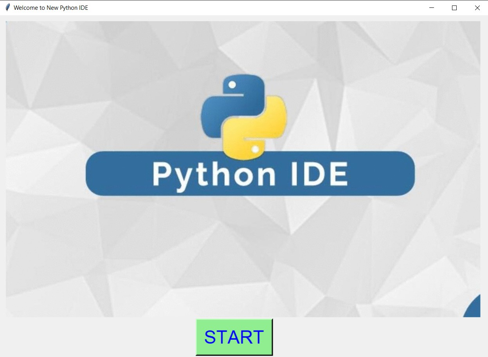
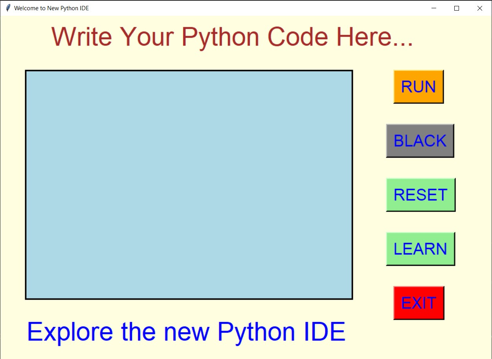
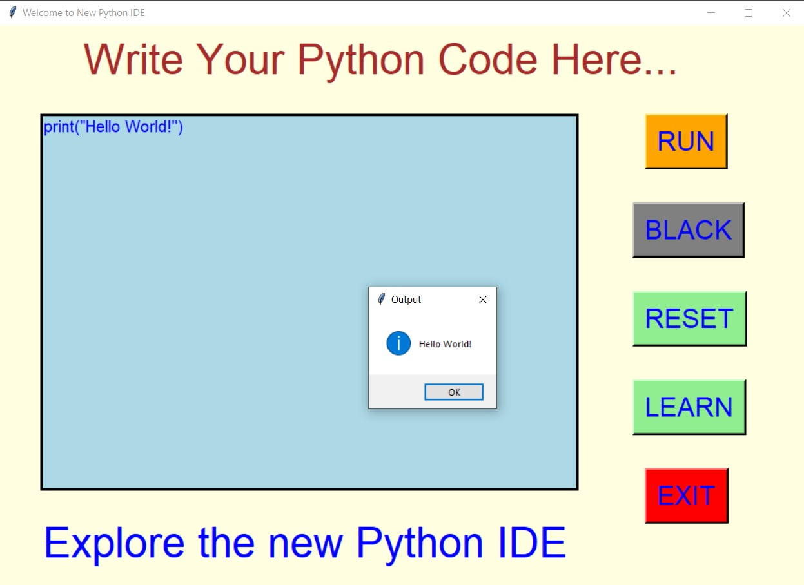
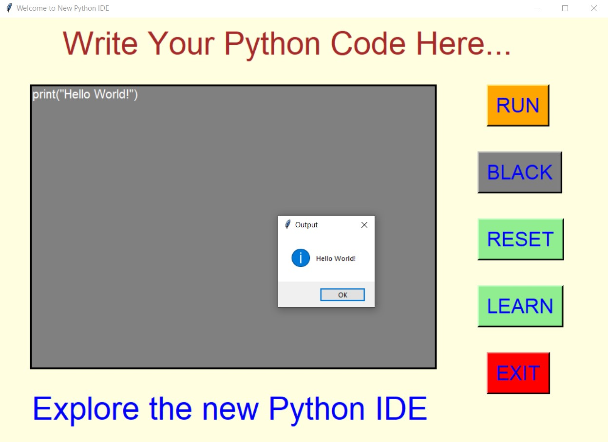
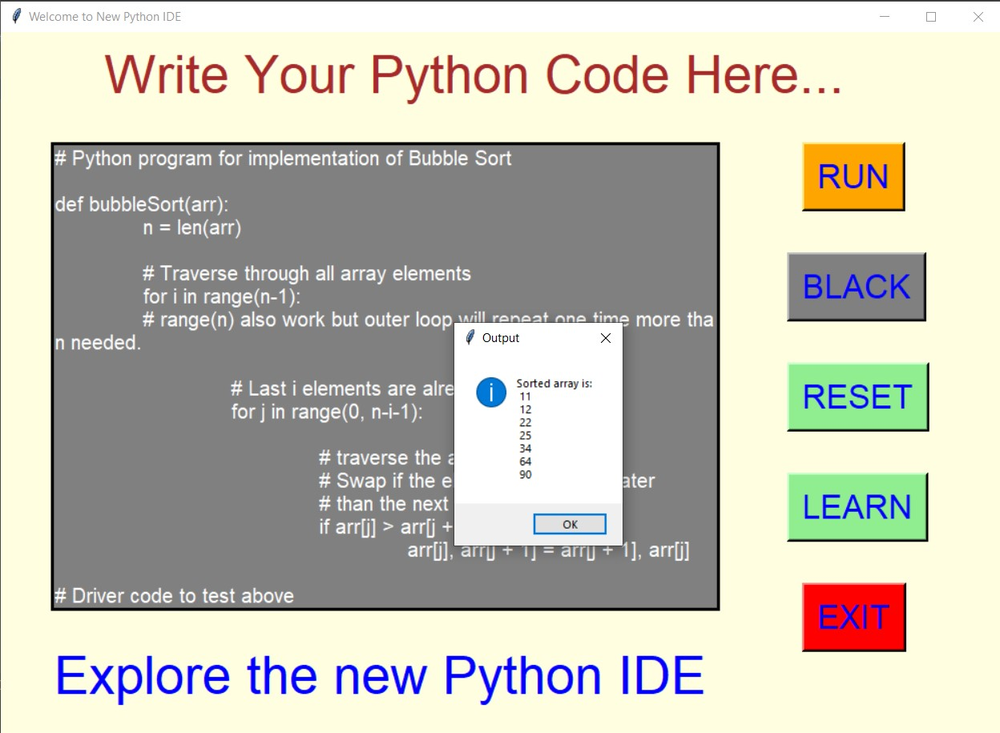
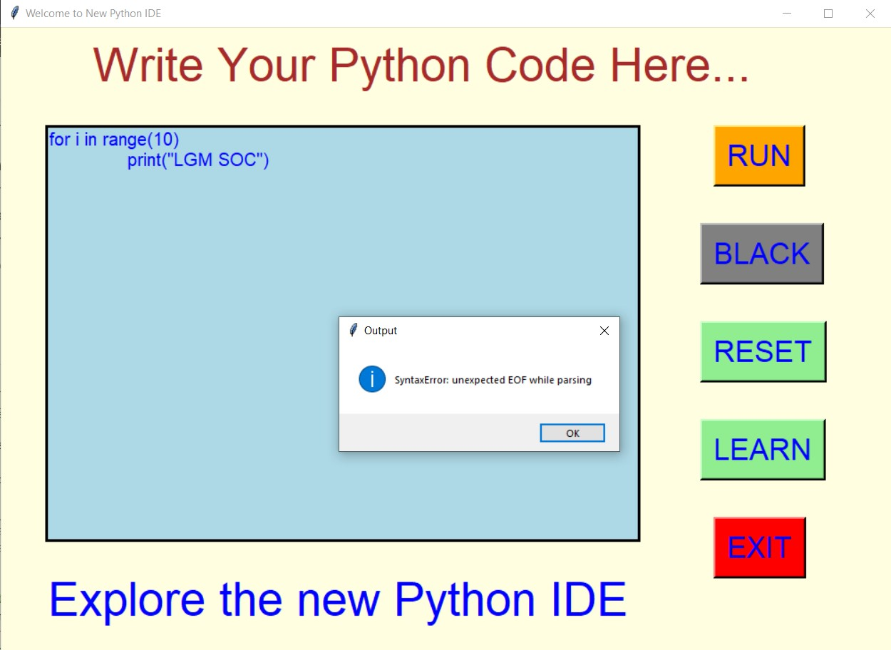
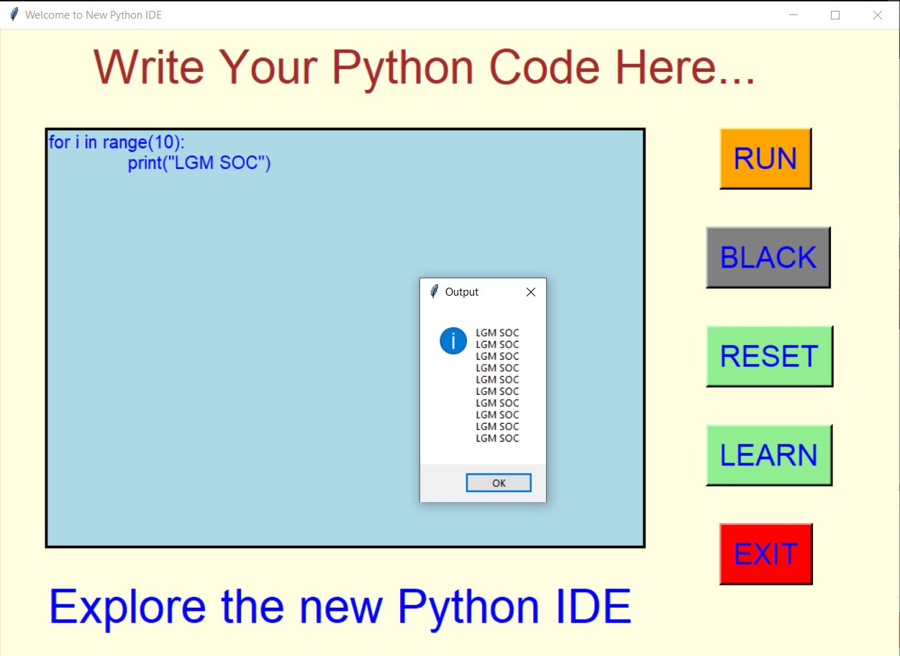
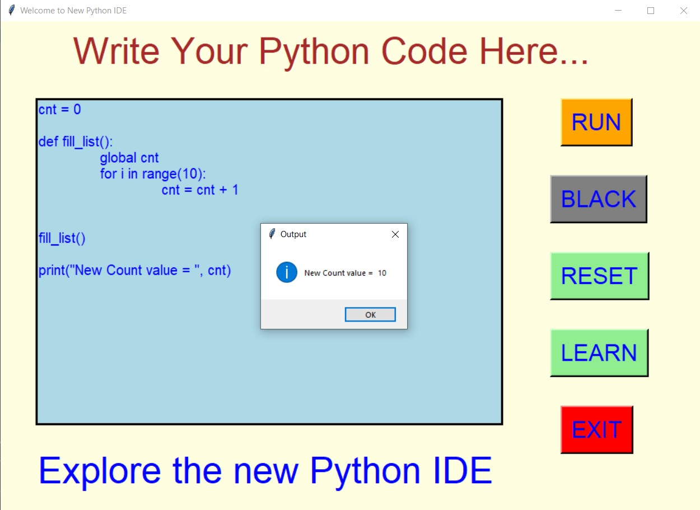
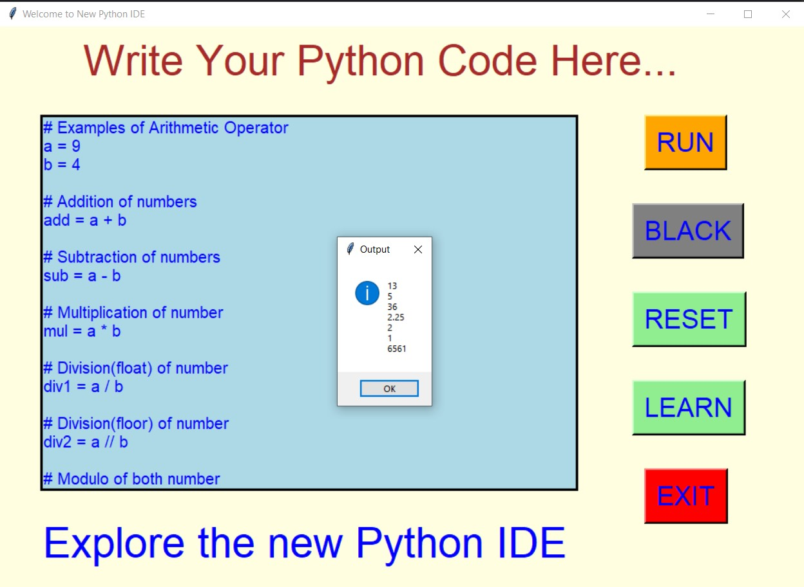
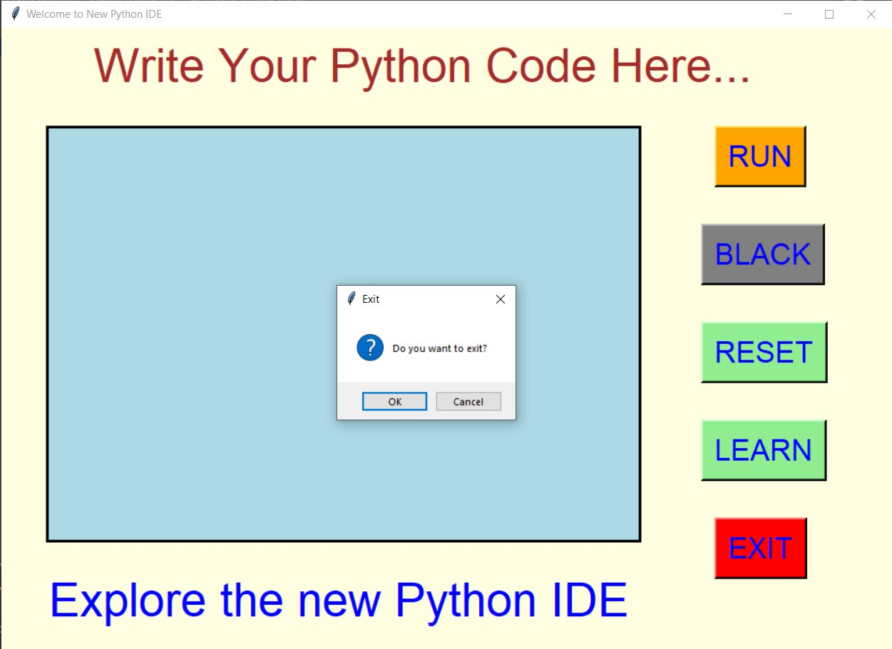

Simple Python IDE
- ### A "Simple Python IDE" is an python IDE created in python with tkinter gui.
- ### In this IDE, user will be able to run python code and see the output in the message box, by clicking on the RUN button.
- ### Here user will also be able to change the background to black mode using the BLACK button.
- ### Using RESET button user can also clear the written code and reset the background of code area to normal background.
- ### Also there is a button LEARN, clicking on which a Geeks for Geeks - Python learning website will open.

****

Requirements :
- ### python 3
- ### tkinter module
- ### from tkinter messagebox module
- ### from io import StringIO
- ### webbrowser

****

****

Screenshots :

****

   
   
   
   
   
   
   
   
   
   
   
   

***

